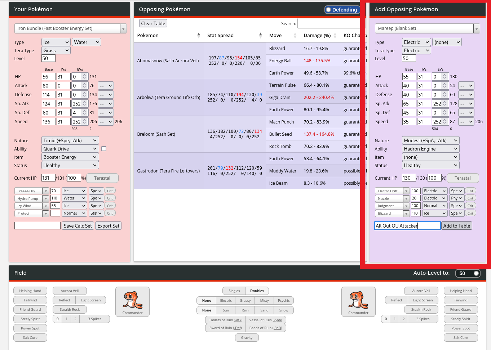
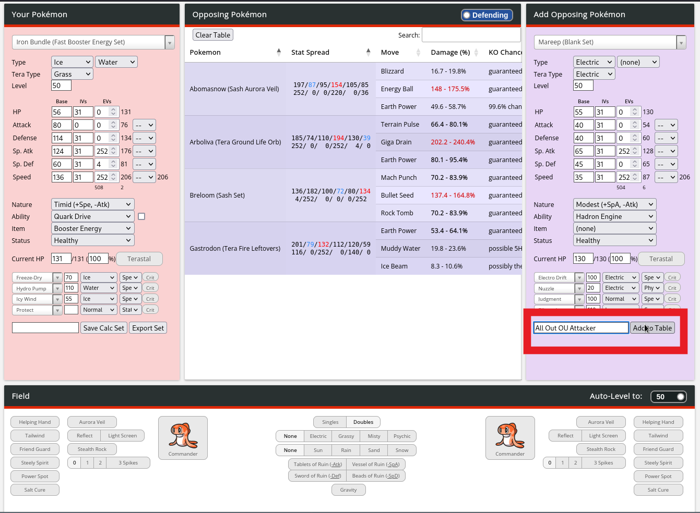
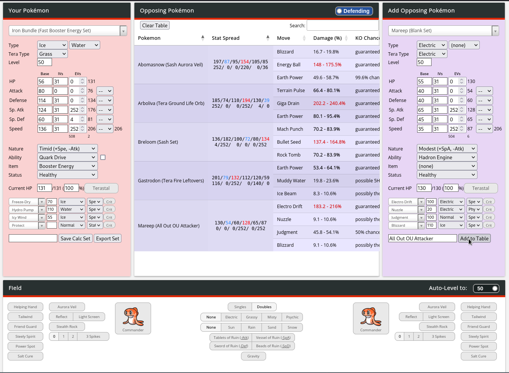
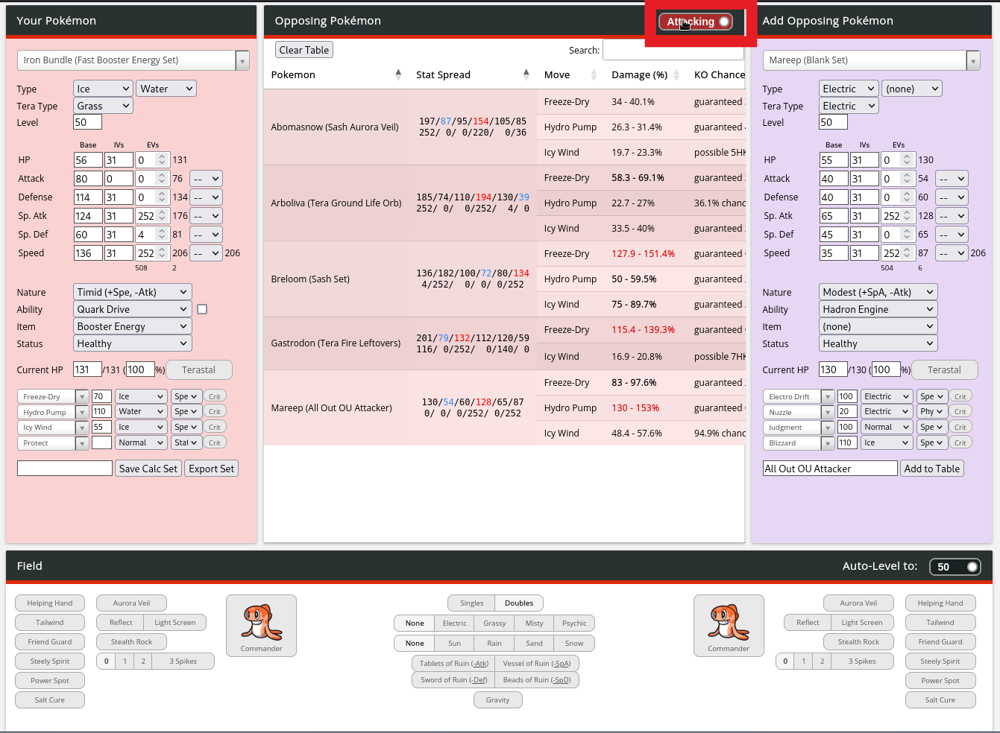
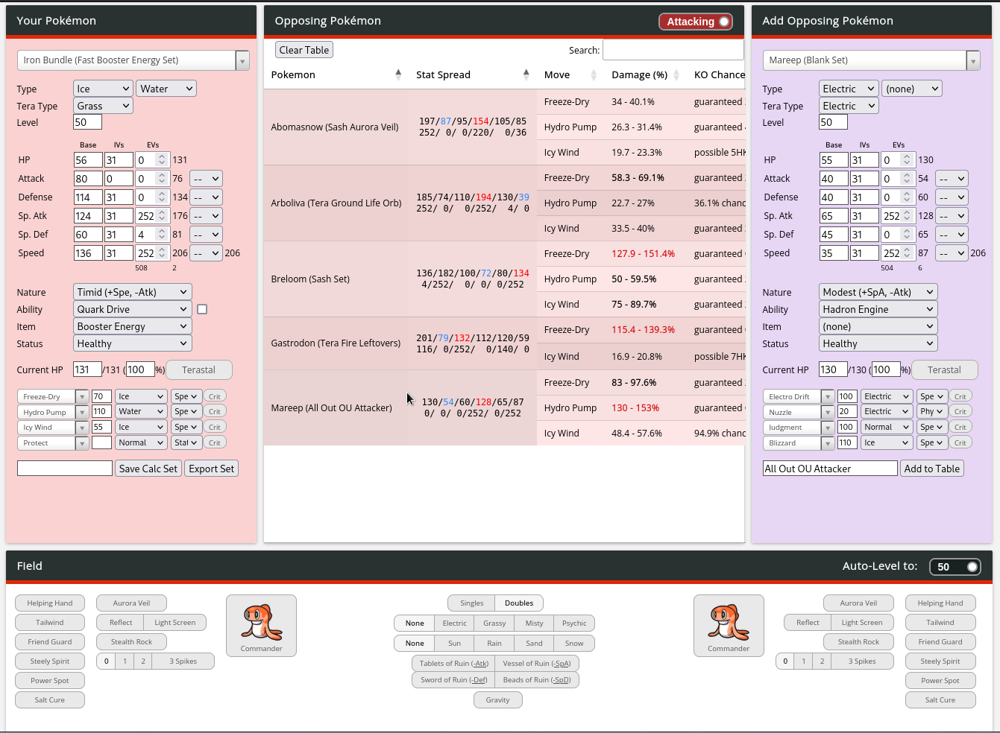

# VGC 2023 Team Building Damage Calculator
Originally the official Nuggetbridge damage calculator 2015-2016, later adapted for Trainer Tower 2017-2020, now adapted for Nimbasa City Post in 2021-present. Maintained and developed by nerd-of-now. UI modified by tzarii to allow for multiple calcs to be displayed at once.

If there are inaccuracies please submit an issue or pull request!

# HOW TO USE
-------------
In order to add a pokemon to the table, first input your set into the "Add Opposing Pokémon" Panel.

Then press the "add to table" button on the panel to add the set to the table.

Afterwards the set will show up in the table and show how it matches up against the set in the "Your Pokémon" panel.

In our case it shows how much damage Mareep (and other pokemon in the table) will do to Iron Bundle. To see how much damage Iron Bundle will do to the pokemon in the table, press the Attack/Defend toggle at the top of the table.

And to remove a set from the table, simply click on it

Credits and license
-------------------

MIT License.

Written by Honko. VGC 2015 Update by Tapin and Firestorm. VGC 2016, 2017, 2018, 2019, and 2020 done by squirrelboyVGC. VGC 2021 onwards done by nerd-of-now.
